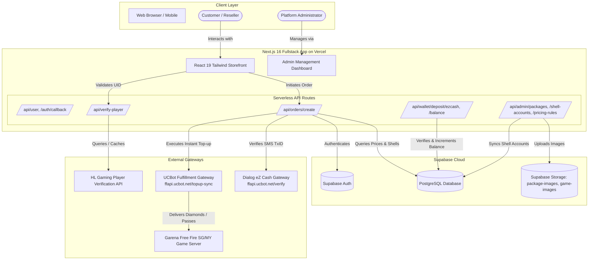

# ShadowTopUp — Complete System Architecture & Operational Workflow

## 1. Executive Summary

**ShadowTopUp** is an automated gaming top-up & reseller management platform specialized in **Garena Free Fire (SG/MY region)**. It enables direct retail customers and B2B resellers to purchase diamond packages, membership passes, and level-up rewards with instant automated game delivery via official Garena Shell accounts.

---

## 2. End-to-End System Architecture

---

## 3. Core Operational Workflows

### Workflow A: Player Account Verification (Step 1)
1. Customer enters their numeric **Free Fire Player UID** (e.g. `8718615060`).
2. The browser checks `localStorage` (`ff_ign_<UID>`) for an instant cached nickname.
3. If not cached, the request routes to `/api/verify-player`:
   - Server checks in-memory `playerCache` to prevent rate-limit depletion.
   - If not in memory, server queries the 3rd-party provider (`proapis.hlgamingofficial.com`).
   - If the external API quota is exceeded (HTTP 429), the account is marked `Account Verified & Ready for Top-Up`.
   - Customer can click **"Set In-Game Name"** to input and save their exact IGN, which is cached for all future checkouts.

---

### Workflow B: Package Selection & Tier Pricing (Step 2)
1. Catalog is organized into 3 tabs:
   - **1. 👑 Memberships** (Default active tab: Weekly Lite, Weekly VIP, Monthly VIP, EVO 3D, EVO 7D, EVO 30D)
   - **2. 🎯 Level Up Packages** (Level Up 6, 10, 15, 20, 25, 30)
   - **3. 💎 Diamonds** (25, 100, 310, 520, 1060, 2180, 5600, 11500 Diamonds)
2. **Dynamic Pricing Rules**:
   - **Normal Tier**: Base Shell Cost $\times$ LKR 2.60 $+ 35\%$ markup.
   - **Silver Reseller Tier**: Base Shell Cost $\times$ LKR 2.60 $+ 23\%$ markup.
   - **Gold Reseller Wholesale Tier**: Base Shell Cost $\times$ LKR 2.60 $+ 15\%$ markup.
   - Pricing rules and shell costs are enforced strictly **server-side** to eliminate client tampering.

---

### Workflow C: Payment & Automated Fulfillment (Step 3)

#### 1. Instant Shadow Wallet Checkout
- Verifies authenticated session and checks `profiles.wallet_balance >= orderPrice`.
- Selects the best active Garena Shell account with sufficient shell balance (`gte(available_balance, shell_cost)`).
- Atomically dispatches top-up to **UCBot API** (`https://ffapi.ucbot.net/topup-sync`).
- Upon success:
  - Deducts `orderPrice` from `profiles.wallet_balance`.
  - Updates remaining shell balance in `shell_accounts`.
  - Records transaction audit in `wallet_transactions` and `orders`.
  - Emits the modern digital receipt.
- **Fail-Safe Protection**: If Garena/UCBot delivery fails, the wallet balance is **not charged**.

#### 2. Dialog eZ Cash Automated SMS Checkout
- Customer transfers funds via Dialog eZ Cash USSD (`#111#` or MyDialog app) to `0765604635` (`Shadow Store`).
- Customer enters the SMS **Transaction ID** (TxID).
- Backend verifies TxID with Firebase/UCBot gateway (`https://ffapi.ucbot.net/verify`):
  - Prevents replay attacks (verifies TxID was not previously claimed).
  - Enforces underpayment protection ($\text{paidAmount} \ge \text{verifiedPrice}$).
- Dispatches top-up to UCBot and generates an instant delivery receipt.
- **Fail-Safe Protection**: If delivery fails after valid payment, the full amount is **100% credited to the customer's Shadow Wallet**.

#### 3. Bank Transfer (Manual Verification)
- Customer uploads bank transfer slip image.
- Image is securely stored, and order is created in `pending` status.
- Administrator verifies proof in Admin Dashboard (`/admin/orders`) and approves the order.

---

## 4. Modern Digital Receipt Engine

The receipt modal (`TransactionReceiptModal.tsx`) features:
1. **Glowing Emerald Status**: Circular badge with animated pulse and clear delivery message.
2. **Structured Metadata Rows**: Order Receipt ID, Date & Time, Package Name, Items Delivered, Free Fire Player UID, Player Nickname, Garena Trx ID, Payment Method, and Customer.
3. **Reseller Store Branding**:
   - For Resellers: Highlights the reseller shop banner `ISSUED BY RESELLER STORE: {storeName}` and reseller tier badge (`GOLD TIER`, `SILVER TIER`).
   - For Regular Customers: Displays only `CUSTOMER: {customerName}` and standard platform branding.
4. **Amount Paid Highlight Box**: Prominent dark container with glowing purple/indigo text.
5. **Trust Badges & QR Code Verification**: Displays security badges and interactive QR verification widget.
6. **Export Tools**: Direct high-resolution PNG download and Web Share API integration (for instant sharing to WhatsApp/Telegram).

---

## 5. Deployment Architecture: Vercel vs. Render

| Component | Platform | Role & Responsibilities |
|---|---|---|
| **Frontend & API Routes** | **Vercel** (Primary) | Hosts the Next.js 16 application, customer UI, admin portal, and all 27 serverless backend API endpoints (`/api/...`). Zero cold-starts and global CDN caching. |
| **Database & Auth** | **Supabase** (Managed) | PostgreSQL database, Supabase Auth (JWT sessions), Row Level Security (RLS), and file storage. |
| **Backend Microservice** | **Render** (Optional) | Optional Express service (`backend/`) for standing health-checks and external webhook receivers if a dedicated container is desired. |
| **Worker Daemon** | **Removed** | Obsolete Puppeteer desktop worker has been completely deleted. All fulfillment is handled in real-time via UCBot REST API. |

---

## 6. Database Migrations Directory (`supabase/migrations/`)

- `001_core_schema.sql`: Core tables (`profiles`, `games`, `packages`, `orders`, `reviews`) and user trigger.
- `002_shell_accounts.sql`: Garena shell accounts table, balance tracking, and autocode encryption.
- `003_pricing_rules_and_package_codes.sql`: Pricing rules for normal/silver/gold tiers and official UCBot package codes.
- `004_shadow_wallet_and_ezcash.sql`: Shadow wallet balance, voucher redeem codes, wallet audit logs, and Dialog eZ Cash transactions.
